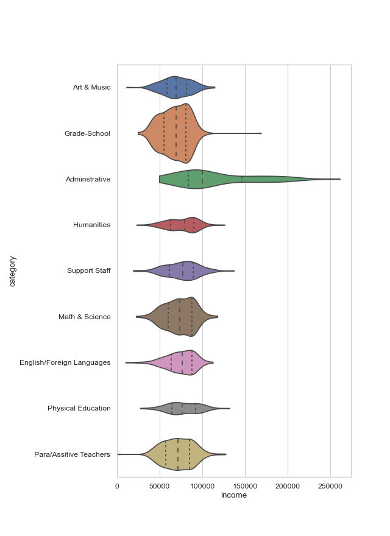

# OPS-IncomeVis (v1.0.1)
A side project to practice data viz of employee income from publicly available info. 

Employee list retrieved [here](https://www.olatheschools.org/domain/50) and saved as directory.mhtml.

The data is scraped using [csvCreator.py](csvCreator/csvCreator.py) which takes approximately ~.5 seconds a search over 2000 searches results in ~15 minute
time to gather all the income data. This file does the whole process from processing mthml, accessing govsalaries and processing it, to saving the csv.

The employee positions are extradorinarly wide ranged, and I had to create [categoryCreator.py](csvCreator/categoryCreator.py) in order to
boil it down into the categories seen in the image below. If you're curious how I categorized positions, look in [CAT_KEY.json](csvCreator/CAT_KEY.json).

# Result
No outlier handling is done, so there are a couple of weird data points... Oh well ¯\\\_(ツ)_/¯

Here is the final result created using [vizualizer.py](vizualizer.py):


# Usage
In order to use this, god forbid you are some random person trying to: You have to pass an employees.json ([example here](csvCreator/employees.json)) 
into categoryCreator/catergorize function,then using that json, pass it into the gatherer.gatherFromJson. An example of a modified csvCreator, for
your own data that matches the format of employees.json is shown below
```python
import categoryCreator
import gatherer

json = None
with open('CAT_KEY.json') as f:
    json = json.loads(f.read())

# the fancy formatting isn't necessary, but if you want to save it it's nice
json = json.dumps(categoryCreator.catergorize(json), indent=4)

#change the gatherer.py to change how it exports.
gatherer.gatherFromJSON(json)
```

If you want to change the categories you'll have to modify [categoryCreator.py](csvCreator/categoryCreator.py) here:
```python
CATEGORIES = [
    'Adminstrative', #rest is omitted
]
```
Then running the categoryCreator.py from shell, it'll prompt you to organize job titles into the catergories you specify.
categoryCreator.py will only work if the employees.json is setup properly. You can add more tags and modify to use them as needed.
```Hjson
{
    "employees": { //You can't change this.
        "first last": { 
            "location": "", //optional tag
            "position": "jobTitle" //this tag is required for categoryCreator to work
        },
    }
}
```

The CSV of scraped data is [here](income.csv)


